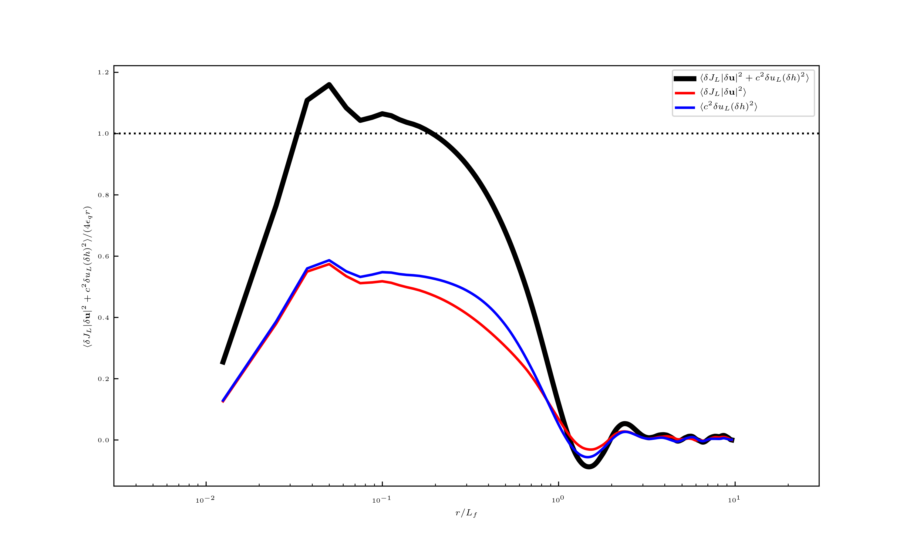
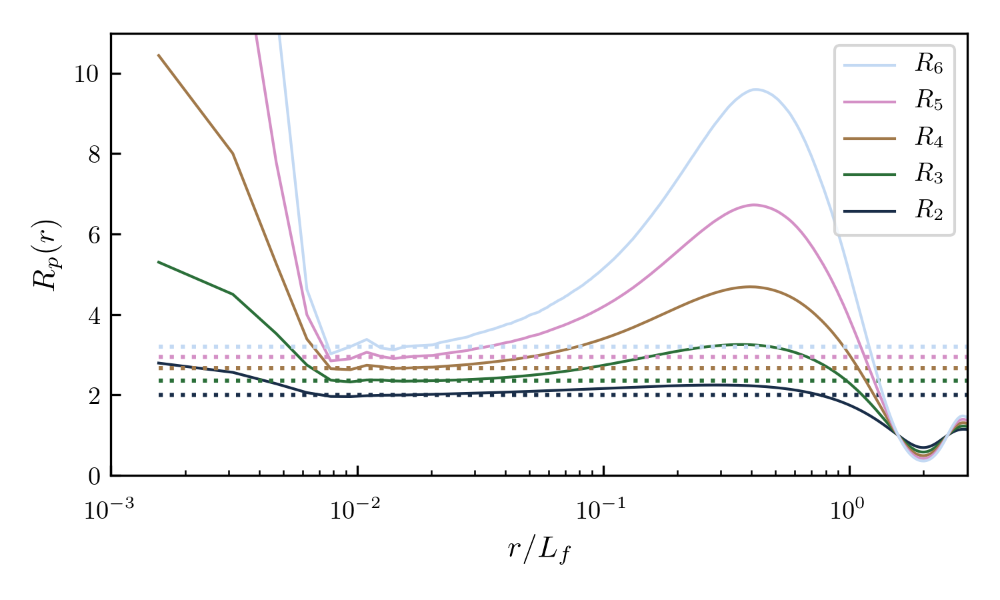
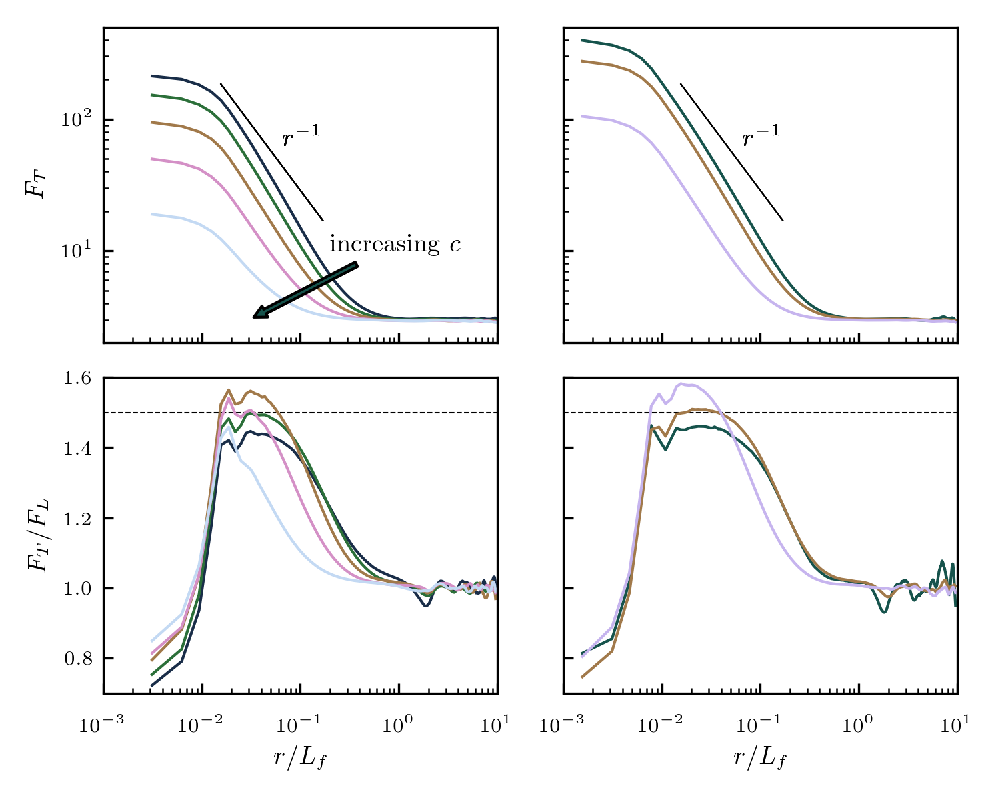

List of Figures
===============

.. figure:: ../Pyfig/fig_Emean_time.png
   :alt: Space averaged energy
   :math:`\langle h|{\textbf{u}}|^2 + c^2 h^2 \rangle/2` versus time for
   different wave speeds :math:`c` and resolutions :math:`n`. The energy
   and the time are normalized by :math:`E_f\equiv (P_0/k_f)^{2/3}` and
   :math:`T_f\equiv (P_0 {k_f}^2)^{-1/3}`, with
   :math:`P_0 = 1 \simeq {\varepsilon}`. The colors corresponds to
   different wave speeds as indicated in the figure :math:`c= 10`, 20,
   40, 70, 100, 200, 400, 700 and 1000. The different resolutions are
   represented by different types of lines: thin continuous lines,
   :math:`n = 240`; thick dashed lines, :math:`n = 480`; thin dotted
   lines, :math:`n = 960`; thick continuous lines, :math:`n = 1920`;
   thin dashed lines, :math:`n = 3840`; thick dotted lines,
   :math:`n = 5760` and thin dotted dashed lines, :math:`n = 7680`.
   :width: 5.12000in

   = 100` and :math:`n = 3840`. The fluxes are nondimensionalized by
   :math:`{\varepsilon}` and plotted versus :math:`k/k_f`.
   :width: 3.15000in

   Kolmogorov law ([eq\_Kolmo]) averaged over a long simulation for
   :math:`c = 20` and :math:`n = 3840`. The structure functions are
   normalized by :math:`4 {\varepsilon}r`. Black thick line,
   :math:`{\langle  \delta J_L|\delta {\textbf{u}}|^2  \rangle} 
   + c^2{\langle \delta u_L(\delta h)^2 \rangle}`; light thin line,
   :math:`c^2{\langle \delta u_L (\delta h)^2 \rangle}`; dark thin line,
   :math:`{\langle \delta J_L |\delta {\textbf{u}}|^2 \rangle}`. The
   dotted straight line shows :math:`4 {\varepsilon}_q r`, where
   :math:`{\varepsilon}_q` is the quadratic energy dissipation rate.
   :width: 3.15000in

   energy (thin dark line) and available potential energy (thin light
   line) for :math:`c = 40` and :math:`n = 7680`.
   :width: 8.00000cm

   for :math:`p = 2,` 3 and 4. The dotted straight lines indicate the
   values computed by the shock model: :math:`R_2 = 2`,
   :math:`R_3 = 6\pi/8` and :math:`R_4 = 8/3`. The wave speed and the
   resolution are :math:`c = 10` and :math:`n = 7680`.

   indicate the :math:`r^{-1}`-scaling and the straight dashed line the
   :math:`r^{-3/2}`-scaling. The inset shows the ratio :math:`F_T/F_L`
   and the corresponding value computed by the shock model,
   :math:`F_T/F_L = 1.5`.

